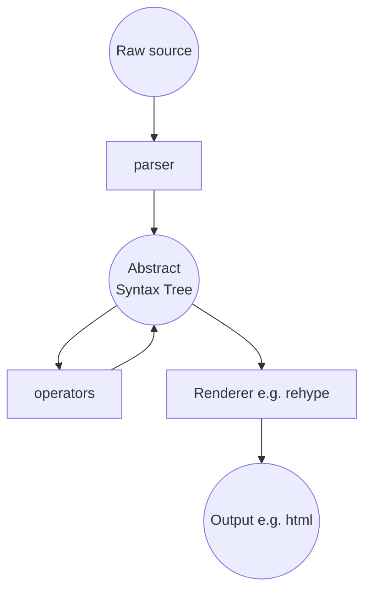

# Markdown Processing Pipeline

## Mermaid version 2023-03-06





## Sketch 2023-02-23


## Aside: re markdown and its extensions

Aside: this relates to defining document types. Yes, files are markdown ... but markdown is highly extensible. So, the real question is not "markdown" but what **flavour** of markdown and specifically what features are supported.

To summarize:

- Markdown: a lightweight markup language with plain text formatting syntax. See https://www.datopian.com/playbook/markdown
- MDX: Markdown enhanced with code (javascript) i.e. you can weave content and code. "Code literate" markdown.
  - OK, so i can use components (aka external code) in my markdown ...
  - But what components - i mean there is a linking problem right? I can't just do `import cool-library/SomeComponent` and expect it to work ... we
- So the questions arises
  - What components are supplied for use in MDX
  - What other formatting / processing are you doing i.e. what remark plugins are you using
  - Even more generally, what additional layout / formatting / styling are you doing with the core doc

Other points:

- we don't want many of our users to have to be familiar with JSX or even javascript
  - cf https://mdxjs.com/docs/what-is-mdx/#prerequisites which states "To write and enjoy MDX, you should be familiar with both markdown and JavaScript (specifically JSX).
  - Yes, "we" are using MDX but it is not what we want to expose to end users that much. They just want to be able to use some magic and have it work e.g. insert `<DataTable src="data.csv" />` and just have it work
    - Sure power users can take advantage ...

### What is MDX?

See https://mdxjs.com/docs/what-is-mdx/

> MDX allows you to use JSX in your markdown content. You can import components, such as interactive charts or alerts, and embed them within your content. This makes writing long-form content with components a blast.

https://mdxjs.com/docs/what-is-mdx/

> This article explains what the MDX format is. It shows how markdown, JSX, JavaScript expressions, and `import` and `export` statements in ESM can be used inside MDX

...

> More practically MDX can be explained as a format that combines markdown with JSX and looks as follows:

```markdown
# Hello, world!

<div className="note">
  > Some notable things in a block quote!
</div>
```

## How Markdown Pipeline Complexity Arises 2023-03-06


