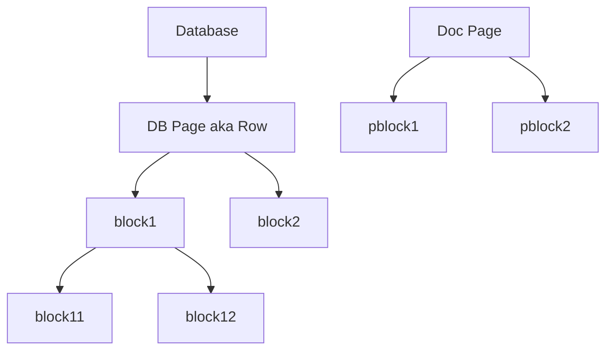

# Notion Domain Model

See https://developers.notion.com/reference/

Summary: notion operates on a tree of blocks. Root tree types are Page, Database i.e. their parent can be whole workspace. Though note these can also have parents being a block, page or database.

- Every block has a unique parent.
- Workspaces are the ultimate root element
- Pages, Databases and Blocks can have children of any type

Interestingly (and rightly) a page is either a row in a database or a classic Page.

The rough structure would be here:

Reference:

- https://developers.notion.com/reference/block A block object represents a piece of content within Notion. The API translates the headings, toggles, paragraphs, lists, media, and more that you can interact with in the Notion UI as different block type objects.
- https://developers.notion.com/reference/page The Page object contains the page property values of a single Notion page. All pages have a Parent. If the parent is a database, the property values conform to the schema laid out database's properties. Otherwise, the only property value is the title. Page content is available as blocks. The content can be read using retrieve block children and appended using append block children.
- Everything located in a workspace. Objects have a single parent.
  - https://developers.notion.com/reference/parent-object Pages, databases, and blocks are either located inside other pages, databases, and blocks, or are located at the top level of a workspace. This location is known as the "parent". Parent information is represented by a consistent parent object throughout the API.
  - Parenting rules:
    - Pages can be parented by other pages, databases, blocks, or by the whole workspace.
    - Blocks can be parented by pages, databases, or blocks.
    - Databases can be parented by pages, blocks, or by the whole workspace.
